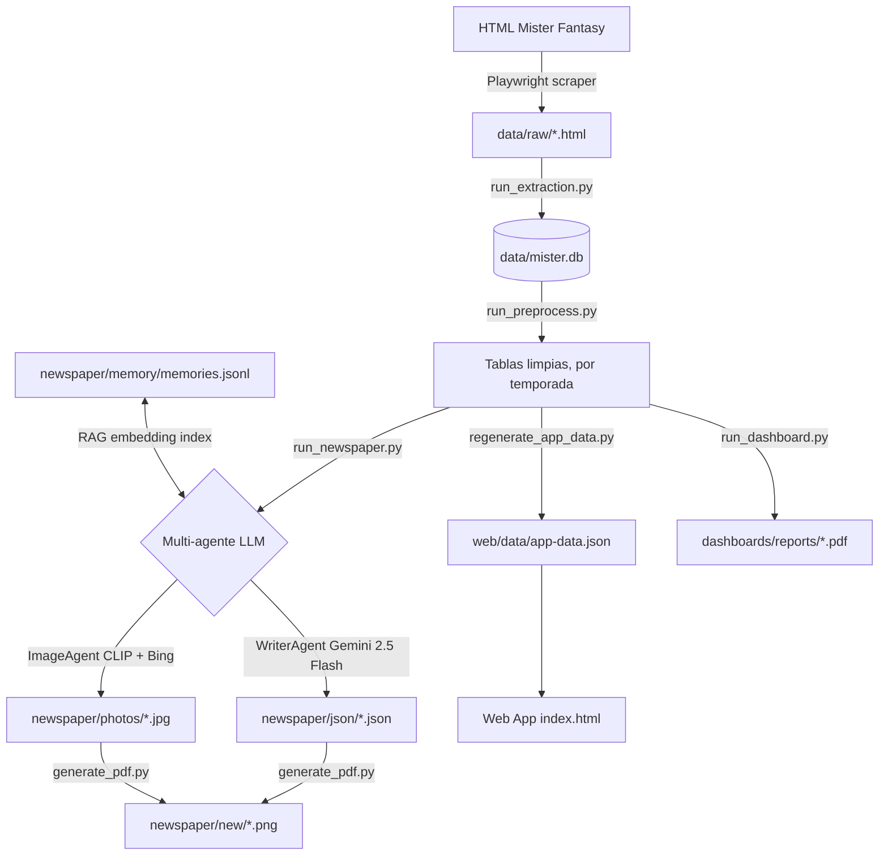

# MisterFantasy Analytics

Sistema de análisis, generación de contenido y visualización para la **Sotano League** — una liga fantasy privada de fútbol entre amigos.

---

## ¿Qué hace este proyecto?

1. **Scraping** — Extrae datos del HTML de Mister Fantasy (clasificación, jornadas, mercado, quinielas)
2. **Procesado** — Limpia y normaliza los CSVs extraídos
3. **Periódico IA** — Genera una portada de periódico sensacionalista con multi-agentes LLM + fotos descargadas automáticamente
4. **Dashboards PDF** — Informes mensuales visuales por manager
5. **Web App** — Estadísticas en tiempo real accesibles desde el navegador

**Persistencia de datos**: la fuente de verdad es `data/mister.db` (SQLite), no CSVs sueltos. Cada tabla lleva una columna `temporada`, así que varias temporadas conviven en la misma base de datos sin colisionar (la jornada 1 de una temporada nueva no pisa a la de la anterior). La temporada activa se define en `config/config.yaml` (`season.current`). El histórico anterior a esta migración vive en `archive/temporada_2025-26/` como copia de seguridad ya importada a la BD. Para exportar una temporada a CSV manualmente: `python scripts/export_db_to_csv.py [temporada]`.

---

## Flujo del sistema



---

## Estructura del proyecto

```
├── config/              # config.yaml (incluye season.current) + .env (API keys)
├── data/
│   ├── raw/             # HTMLs scrapeados (no commiteados)
│   ├── processed/       # export local opcional de CSVs (no commiteado, ver export_db_to_csv.py)
│   └── mister.db        # fuente de verdad — SQLite particionado por `temporada`
├── newspaper/
│   ├── json/
│   │   ├── articles/    # JSONs de datos de cada jornada
│   │   └── cards/       # Cards generadas por el LLM
│   ├── new/             # Imágenes PNG de las portadas
│   └── photos/          # Fotos de jugadores descargadas
├── scripts/             # Scripts de entrada — ver scripts/README.md
├── src/
│   ├── agents/          # OrchestratorAgent, WriterAgent, ImageAgent
│   ├── AI_newspaper/    # Pipeline de contenido del periódico
│   ├── data/            # Extractores y mergers de CSV
│   ├── memory/          # Sistema RAG (EmbeddingStore, MemoryStore)
│   ├── preprocessing/   # Limpieza de datos de mercado
│   ├── scraper/         # Login Playwright
│   ├── utils/           # Config, team_map, helpers
│   └── visualization/   # Dashboards y PDFs
├── tests/               # Suite de tests pytest (unitarios + integración)
├── web/                 # Web App estática
│   ├── data/app-data.json
│   └── ...
└── assets/
    └── web/             # Escudos/logos de managers (128×128px para la web)
```

---

## Quickstart

### 1. Instalar dependencias

```bash
pip install -r requirements.txt
playwright install chromium
```

### 2. Configurar credenciales

```bash
cp config/.env.example config/.env
# Editar config/.env con tus API keys
```

Variables necesarias: `GROQ_API_KEY`, `GEMINI_API_KEY`

### 3. Ejecutar el pipeline completo

```bash
# Extraer datos del HTML (requiere HTML descargado manualmente)
python scripts/run_extraction.py

# Limpiar y normalizar los datos extraídos
python scripts/run_preprocess.py

# Generar periódico IA (requiere API keys)
python scripts/run_newspaper.py

# Regenerar app-data.json para la web
python scripts/regenerate_app_data.py
```

Ver [`scripts/README.md`](scripts/README.md) para la referencia completa de scripts.

---

## Tests

```bash
# Todos los tests
pytest tests/ -v

# Solo unitarios (rápido, sin red ni APIs)
pytest tests/ -v -k "not integration"

# Solo integración
pytest tests/ -v -k "integration"
```

---

## Stack tecnológico

| Componente | Tecnología |
|-----------|-----------|
| Scraping | Playwright |
| Datos | pandas, numpy |
| Agentes LLM | Strands Agent Framework |
| Orchestrator LLM | Groq — Llama 3.3 70B |
| Writer LLM | Google Gemini 2.5 Flash |
| Clasificación de fotos | CLIP (clip-ViT-B-32) |
| Búsqueda de fotos | Bing Image Search |
| RAG embeddings | sentence-transformers (paraphrase-multilingual-MiniLM-L12-v2) |
| Validación de esquemas | Pydantic v2 |
| Visualización | matplotlib, reportlab |
| Web App | HTML/CSS/JS estático |
| Tests | pytest |

---

## Decisiones de arquitectura

Ver [`docs/adr/`](docs/adr/) para las decisiones técnicas importantes documentadas.
