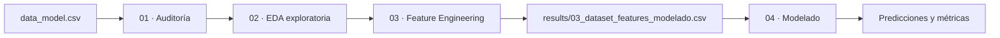

# Fantasy Bidding Intelligence

Subproyecto de Machine Learning para predecir el comportamiento del mercado de jugadores en la Sotano League.

---

## Objetivo

Dado que el mercado de la liga es competitivo y los buenos jugadores se van rápido, este subproyecto responde dos preguntas:

!!! question "Problema 1 — Clasificación"
    **¿Recibirá pujas este jugador mientras esté en el mercado?**

    - Variable objetivo: `recibe_puja` (binaria)
    - Mejor modelo: Random Forest → **ROC-AUC: 0.994**
    - Threshold óptimo en backtesting temporal: **0.36**

!!! question "Problema 2 — Regresión"
    **¿Cuánto se pagará por el jugador si lo compran?**

    - Variable objetivo: `ganancias` (millones, valor negativo = gasto)
    - Mejor modelo: Random Forest Regressor → **R²: 0.90**, MAE: 0.57M

---

## Dataset

**Fuente:** `data/processed/data_model.csv`

| Característica | Valor |
|---------------|-------|
| Filas | 1982 |
| Columnas | 14 |
| Periodo | Oct 2025 – May 2026 (jornadas 11–38) |
| Tasa de compra | ~22% (desbalanceado) |

**Variables clave:**

| Variable | Señal | Descripción |
|----------|-------|-------------|
| `variacion` | Muy alta | Subida/bajada de precio del jugador |
| `precio` | Muy alta | Precio actual en el mercado |
| `avgPoints` | Alta | Media de puntos por jornada |
| `detalles` | Moderada | Días hasta la siguiente jornada |
| `estado` | Muy alta | Estado físico del jugador |
| `posicionJugador` | Alta | Portero/Defensa/Medio/Delantero |

---

## Resultados de modelos

### Clasificación (`recibe_puja`)

| Modelo | ROC-AUC | F1 (backtesting) |
|--------|---------|-----------------|
| Logistic Regression (baseline) | 1.000 | 0.979 |
| XGBoost | 0.9983 | 0.957 |
| Random Forest | **0.9998** | **0.989** |

### Regresión (`ganancias`)

| Modelo | R² | MAE |
|--------|-----|-----|
| Linear Regression (baseline) | 0.867 | 1.55M |
| Random Forest | **0.868** | **1.28M** |

---

## Flujo de notebooks

---

## Limitaciones conocidas

!!! info "Dataset expandido"
    1982 filas (jornadas 11–38, temporada completa Oct 2025 – May 2026). Los modelos anteriores se entrenaron con 304 filas — conviene re-ejecutar los notebooks para validar las métricas con el dataset completo.

!!! info "No integrado con el pipeline principal"
    Los modelos están entrenados y evaluados en los notebooks, pero no hay todavía un script de producción que use las predicciones en tiempo real.
