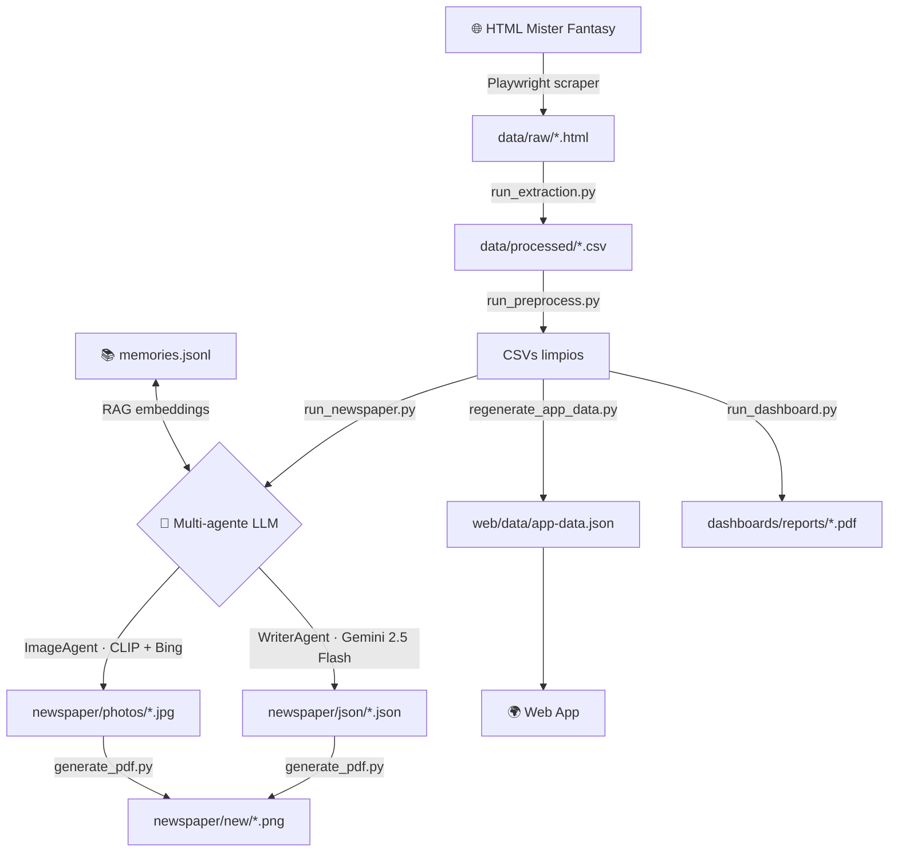

# MisterFantasy Analytics

<div style="text-align:center; margin: 2rem 0">
  <h2 style="color: var(--md-primary-fg-color)">⚽ Sotano League — Sistema de análisis y periódico IA</h2>
  <p>Scraping · Procesado de datos · Multi-agente LLM · CLIP · RAG · Web App</p>
</div>

---

## ¿Qué hace este proyecto?

=== "En una frase"
    Transforma los datos brutos de Mister Fantasy en estadísticas, periódicos generados por IA y una web app interactiva.

=== "En detalle"
    1. **Scraping** — Extrae datos del HTML de Mister Fantasy (clasificación, jornadas, mercado, quinielas)
    2. **Procesado** — Limpia y normaliza los CSVs extraídos
    3. **Periódico IA** — Genera una portada sensacionalista con multi-agentes LLM + fotos automáticas
    4. **Dashboards PDF** — Informes mensuales visuales por manager
    5. **Web App** — Estadísticas en tiempo real accesibles desde el navegador

---

## Flujo del sistema



---

## Quickstart

```bash
# 1. Instalar dependencias
pip install -r requirements.txt
playwright install chromium

# 2. Configurar credenciales
cp config/.env.example config/.env
# → editar config/.env con tus API keys

# 3. Pipeline completo
python scripts/run_extraction.py
python scripts/run_preprocess.py
python scripts/run_newspaper.py
python scripts/regenerate_app_data.py
```

---

## Stack tecnológico

| Componente | Tecnología |
|---|---|
| Scraping | Playwright |
| Datos | pandas · numpy |
| Orchestrator LLM | Groq — Llama 3.3 70B |
| Writer LLM | Google Gemini 2.5 Flash |
| Framework agentes | Strands |
| Clasificación de fotos | CLIP (clip-ViT-B-32) |
| RAG embeddings | sentence-transformers |
| Validación esquemas | Pydantic v2 |
| Visualización | matplotlib · reportlab |
| Web App | HTML/CSS/JS estático |
| Tests | pytest · 140 tests |

---

## Estado del proyecto

- [x] Pipeline de extracción y procesado
- [x] Multi-agente LLM (Orchestrator + Writer + Image)
- [x] CLIP zero-shot para fotos de jugadores
- [x] Sistema RAG local para memoria histórica
- [x] Web App estática
- [x] Suite de 140 tests (unitarios + integración)
- [x] Documentación completa
- [ ] Cache de fotos (no re-buscar si ya existe)
- [ ] Retry automático en errores de API
