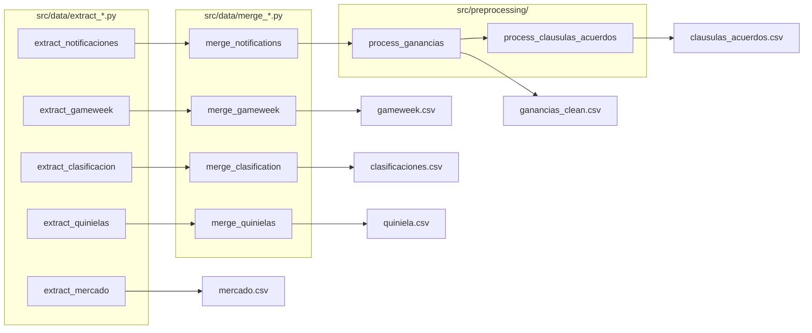

# Extracción de datos

Convierte los HTMLs de Mister Fantasy en CSVs estructurados.

---

## Fuentes de datos

| HTML de entrada | CSV de salida | Contenido |
|----------------|---------------|-----------|
| `dataMister.html` | `ganancias.csv` | Notificaciones de mercado (compras/ventas) |
| `gameweek.html` | `gameweek.csv` | Puntuaciones de jugadores por jornada |
| `ClassificationMister.html` | `clasificaciones.csv` | Clasificación general acumulada |
| `mercado.html` | `mercado.csv` | Estado del mercado |
| `quiniela.html` | `quiniela.csv` | Puntuaciones de quinielas |
| `mi_equipo.html` | `jornadas.csv` | Alineaciones por jornada |
| `MarketSubidasBajadas.html` | `subidasBajadas.csv` | Subidas y bajadas de valor |

---

## Flujo de extracción

---

## Columnas clave de cada CSV

=== "gameweek.csv"
    | Columna | Tipo | Descripción |
    |---------|------|-------------|
    | `Date` | str | Fecha del partido |
    | `Jornada` | int | Número de jornada |
    | `Manager` | str | Nombre del manager |
    | `NombreJugador` | str | Nombre del jugador |
    | `EquipoJugador` | int | ID del equipo (ver `team_map.py`) |
    | `Posicion` | int | 1=Portero, 2=Defensa, 3=Medio, 4=Delantero |
    | `Puntos` | float | Puntos fantasy de la jornada |
    | `Goles` | int | Goles marcados |
    | `Asistencias` | int | Asistencias |
    | `Roja` | int | 1 si tarjeta roja |
    | `PenaltiParado` | int | 1 si paró penalti |
    | `GolPropia` | int | 1 si gol en propia |

=== "ganancias_clean.csv"
    | Columna | Tipo | Descripción |
    |---------|------|-------------|
    | `fecha` | str | Fecha de la operación |
    | `type` | str | `"transfer"` o `"notification"` |
    | `subtype` | str | `"mercado"`, `"clausula"` o `"acuerdo"` |
    | `equipo` | str | Manager que realizó la operación |
    | `jugador` | str | Nombre del jugador |
    | `compra-venta` | str | `"compra"` o `"venta"` |
    | `ganancias` | float | Importe (negativo = gasto, positivo = ingreso) |
    | `equipoLiga` | float | ID del equipo real del jugador |

=== "clasificaciones.csv"
    | Columna | Tipo | Descripción |
    |---------|------|-------------|
    | `jornada` | int | Número de jornada |
    | `nombre` | str | Nombre del manager |
    | `posicion` | int | Posición en la clasificación |
    | `puntos` | float | Puntos acumulados hasta esa jornada |
    | `valor_equipo` | float | Valor total del equipo en esa jornada |

---

!!! warning "IDs de equipo como float"
    El CSV `gameweek.csv` almacena `EquipoJugador` como `float` (ej. `15.0`).
    Usar siempre `map_team()` de `src/utils/team_map.py` para resolver a nombre.
