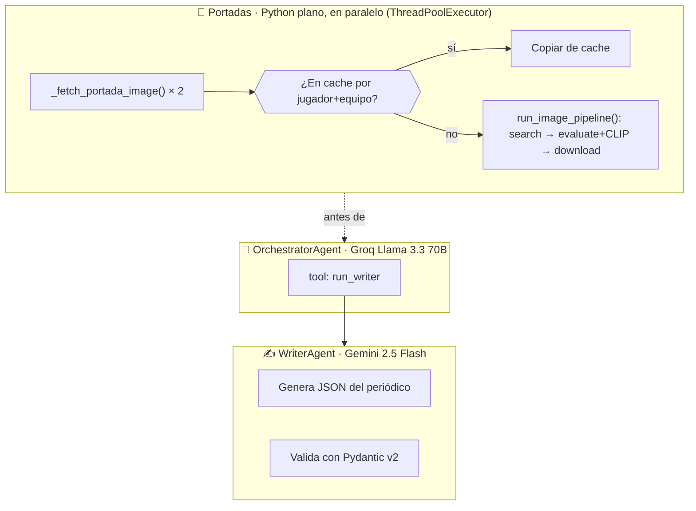

# Pipeline del Periódico IA

El módulo más complejo del sistema. Combina procesado de datos, multi-agente LLM, scraping de imágenes y clasificación ML para generar una portada de periódico.

---

## Arquitectura de agentes



Las fotos de portada ya no son un tool call que Groq deba decidir invocar
— se buscan en paralelo antes de arrancar el `OrchestratorAgent`, con
`run_image_pipeline()` (la misma cadena search→evaluate→download pero sin
LLM), y se cachean por jugador+equipo para no repetir la búsqueda en Bing
si el mismo MVP/fichaje vuelve a salir en portada otro día.

---

## Puntuación de imágenes

El `ImageAgent` puntúa cada candidata con un sistema de hasta **12 puntos**:

| Criterio | Puntos |
|----------|--------|
| Resolución ≥ 1MP | +4 |
| Resolución ≥ 500K px | +2.5 |
| Resolución ≥ 200K px | +1 |
| Formato vertical (portrait) | +2 |
| Formato cuadrado | +1 |
| Tamaño archivo ≥ 200KB | +2 |
| Tamaño archivo ≥ 80KB | +1 |
| Formato JPEG/PNG/WEBP | +2 |
| **CLIP sim ≥ 0.26** (futbolista claro) | **+3** |
| **CLIP sim ≥ 0.22** (probable) | **+2** |

> CLIP sim < 0.22 → imagen descartada directamente (hard filter)

!!! info "¿Por qué CLIP?"
    Antes del CLIP, el sistema rechazaba imágenes válidas por tener score bajo.
    CLIP permite saber si la imagen **realmente contiene un futbolista** sin necesidad de APIs de visión de pago.
    Ver [ADR-001](../adr/001-clip-clasificacion-fotos.md) para más detalle.

---

## Schema del periódico (Pydantic)

```python
TIPOS_CARD = Literal[
    "clasificacion", "rumor", "Fichaje destacado", "Venta récord",
    "MVP de la jornada", "Peor actuación de la jornada",
    "Expulsión", "Héroe bajo palos", "Gol en propia",
]

class Card(BaseModel):
    tipo: TIPOS_CARD        # ← validado estrictamente
    titulo: str
    subtitulo: str
    texto: List[str]        # ← mínimo 1 elemento
    jugador: Optional[str]
    manager: Optional[str]
    puntos: Optional[float]
    dinero: Optional[float]
    equipo: Optional[str]

class FinalJSON(BaseModel):
    cards: List[Card]       # ← mínimo 1 card
```

---

## Tipos de card

| tipo | Cuándo aparece |
|------|----------------|
| `clasificacion` | Siempre — resumen de la tabla |
| `rumor` | Siempre — inventado por el LLM |
| `Fichaje destacado` | Si hay compras en el periodo |
| `Venta récord` | Si hay ventas en mercado libre |
| `MVP de la jornada` | Top 3 jugadores por puntos |
| `Peor actuación de la jornada` | Jugador con menos puntos |
| `Expulsión` | Si hay tarjeta roja |
| `Héroe bajo palos` | Si hay penalti parado |
| `Gol en propia` | Si hay gol en propia |

---

## Output generado

Cada ejecución crea:

```
newspaper/
├── json/
│   ├── articles/jornada_17_json.json    ← contenido del periódico
│   ├── cards/jornada_17_cards.json      ← cards generadas por el LLM
│   └── prompts/jornada_17_prompt.txt    ← prompt enviado al LLM (no en git)
├── new/
│   ├── 2026-03-04_jornada_news.png      ← portada completa
│   └── 2026-03-04_fichajes_news.png     ← portada de fichajes
└── photos/
    └── Portada_Jornada.jpg              ← foto descargada por ImageAgent
```
