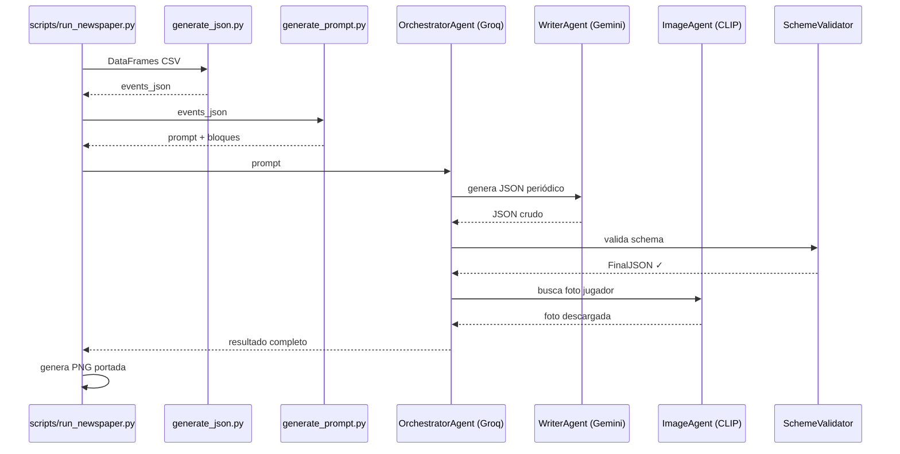
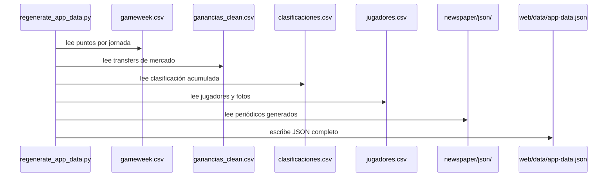
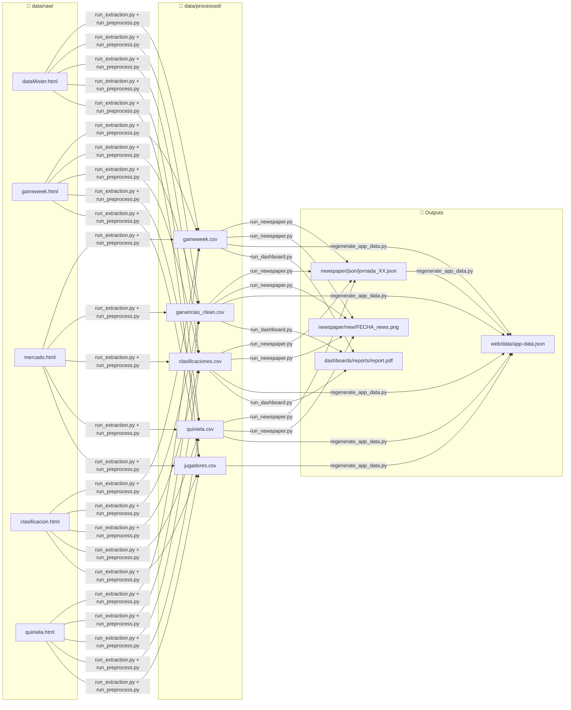

# Visión general del pipeline

El sistema tiene **dos pipelines independientes** que comparten los mismos CSVs procesados como fuente de datos.

---

## Pipeline 1 — Periódico IA

Genera la portada del periódico de cada jornada.

---

## Pipeline 2 — Web App

Regenera los datos estáticos de la web app.

---

## Datos que fluyen entre etapas

---

## Orden de ejecución recomendado

| Paso | Script | Requiere |
|------|--------|----------|
| 1 | `run_extraction.py` | HTMLs en `data/raw/` |
| 2 | `run_preprocess.py` | Paso 1 completado |
| 3 | `run_newspaper.py` | Paso 2 + API keys |
| 4 | `regenerate_app_data.py` | Paso 2 (paso 3 opcional) |

