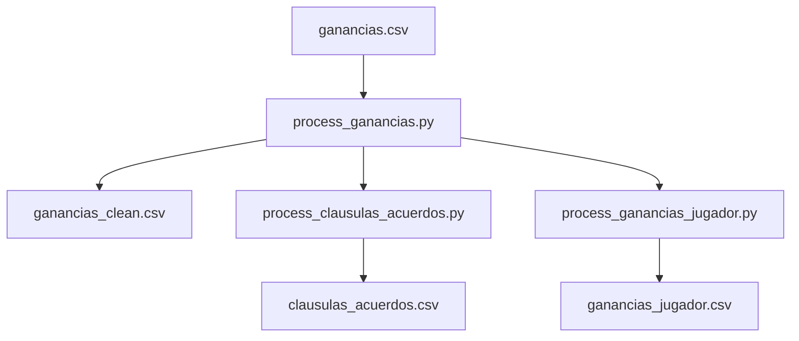

# Preprocesado

Limpia y normaliza los CSVs brutos generados en la extracción.

---

## Módulos de preprocesado



### `process_ganancias.py`
- Elimina filas sin jugador o sin importe
- Clasifica cada operación: `mercado`, `clausula` o `acuerdo`
- Normaliza el campo `compra-venta`
- Añade columna `equipoLiga` (ID del equipo real del jugador)
- **Output:** `ganancias_clean.csv`

### `process_clausulas_acuerdos.py`
- Extrae solo las clausulas y acuerdos entre managers
- Cruza compra con venta del mismo jugador para identificar el manager origen
- **Output:** `clausulas_acuerdos.csv`

### `process_ganancias_jugador.py`
- Agrega las ganancias por jugador (todos sus transfers)
- Útil para análisis de mercado individual
- **Output:** `ganancias_jugador.csv`

---

## Casos especiales gestionados

!!! example "Jugadores sin equipo (`equipoLiga = 0.0`)"
    Hay transfers donde el jugador no tiene equipo en la liga real (libres o retirados).
    El CSV almacena `equipoLiga = 0.0` o `NaN`.
    
    `map_team()` los convierte a `"Sin equipo"` en lugar de devolver `0.0`.

!!! example "Ganancias negativas en compras"
    Las compras tienen `ganancias` **negativas** (el dinero sale).
    Al ordenar por importe de compra, siempre usar `abs(ganancias)`.
    
    ```python
    compras.sort(key=lambda x: abs(x["ganancias"]), reverse=True)
    ```
