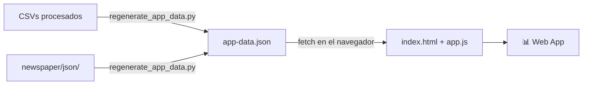

# Web App

Aplicación estática que muestra las estadísticas de la liga en tiempo real.

---

## Cómo funciona



No hay servidor. La app carga `app-data.json` con `fetch()` al abrir el HTML.

---

## Actualizar los datos

```bash
python scripts/regenerate_app_data.py
```

Tiempo de ejecución: **~0.1 segundos**. Sin APIs, sin red.

---

## Estructura de `app-data.json`

Ver la referencia completa en [web/README.md](../webapp.md).

### Resumen de secciones

| Sección | Descripción |
|---------|-------------|
| `generatedAt` | Timestamp de la última regeneración |
| `league` | Stats globales: clasificación, top transfers, manager del mes... |
| `managers[]` | Array de 9 managers con form, mercado, best/worst player |
| `news[]` | Periódicos generados (más reciente primero) |
| `playersMap` | `{ nombre: url_foto }` — 557 jugadores |

---

## Abrir en local

```bash
# Opción 1 — Python
python -m http.server 8080
# → http://localhost:8080/web/

# Opción 2 — VS Code Live Server
# Clic derecho en web/index.html → "Open with Live Server"
```
